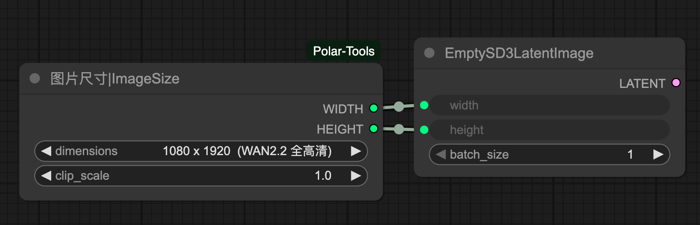
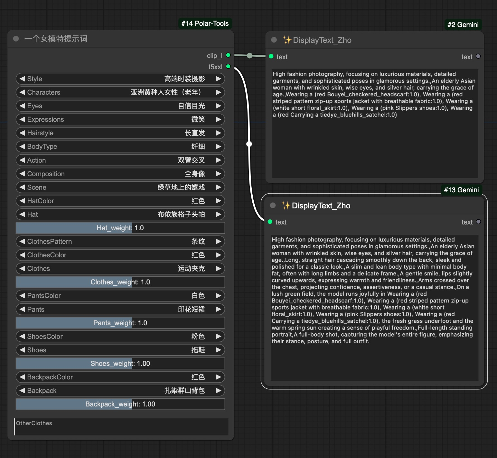
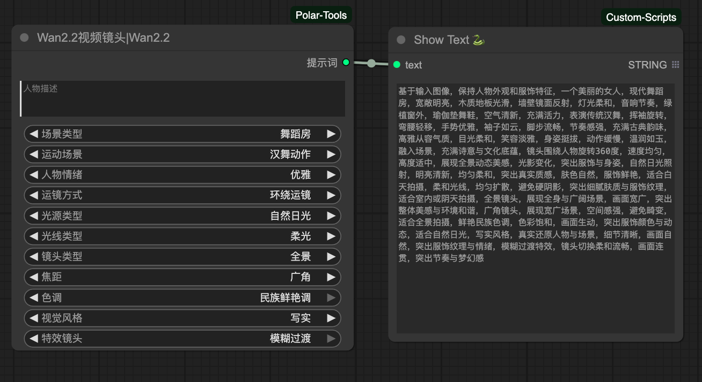
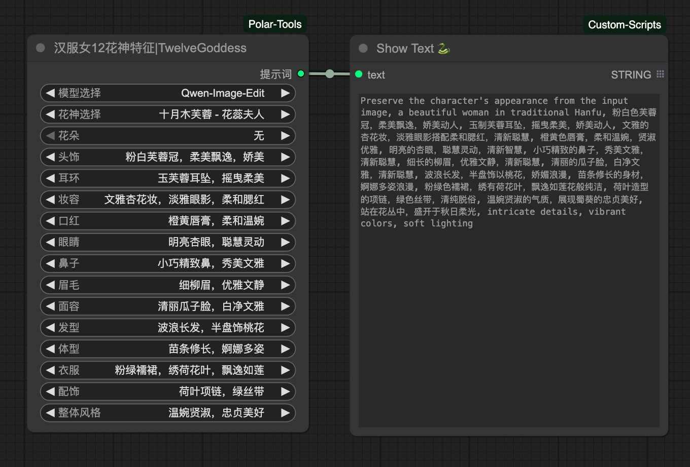

# ComfyUI-Polar-Tools

Polar 的 comfyui 工具箱

1. ImageSize 图片尺寸节点，输出小红书，抖音，liblib 网站,wan2.2 分辨率，全屏尺寸要求宽和高
   

2. OneGirlModelFluxPromptsNode 一个女孩模特提示词，输出 clip_l 和 t5xxl 要求的提示词
   

3. Wan2.2Shooting Wan2.2 视频提示词
   

4. TwelveGoddessFeaturesNode 汉服 12 花神特征提示词
   

5. GufengBeautyNode 古风美女特征提示词
   
